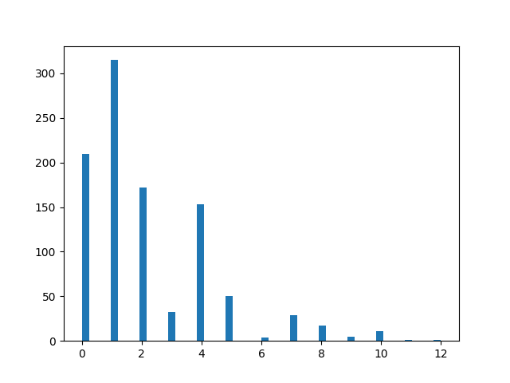

# LayersRanking
Dataset of models for layer ranking evaluation. In this repository, you will find:
- [x] the raw data in `models_dataset.zip` which contains a fodler `Data` and one sub-folder per DNN architecture type and random perturbation distribution
- [x] a minimalist code base to load the models as a dataset iterator in `src`

The current version only supports tensorflow, which is the only requirement. We plan on providing support for torch as soon as possible.
The intended use is the following:

```python
from LayersRanking.src.TFLayersRanking import LayerRankingDataset
import os


dataset = LayerRankingDataset(data_path=os.path.join("LayersRanking","Data", "transfo_dirac"))
for models, rankings in dataset:
    models # is a list of tf.keras.Model
    rankings # for each models[i], the values rankings[i]
             # is the ranking from highest to least important
             # fully connected layer.
```

## Bias in the Dataset

We measure the bias in our dataset to assert that the ranking can not be derived immediatly from the architecture. To do so, we count the occurences of each ranking order 
with the following correspondance: 
 - 0: [3,2,1,0]
 - 1: [1,0]
 - 2: [2,1,0]
 - 3: [0,1]
 - 4: [1,2,0]
 - 5: [2,3,1,0]
 - 6: [1,2,0,3]
 - 7: [2,1,3,0,]
 - 8: [1,0,2]
 - 9: [1,2,3,0]
 - 10: [1,3,2,0]
 - 11: [3,2,0,1]

